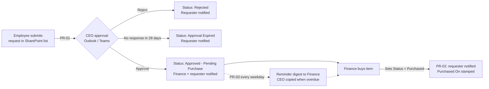

# OfficeAutomation – Purchase Request Approval

An end-to-end purchase request process built only on Microsoft 365 tools that
most organisations already license (SharePoint Online, Power Automate
standard connectors, Outlook, Teams). No premium connectors or Power Apps
licences are needed.

## What it does

1. **An employee submits a purchase request** through a SharePoint list form
   (web, Teams tab or the Microsoft Lists mobile app).
2. **The CEO gets an approval request** in Outlook (actionable email), Teams
   (Approvals app) and the Power Automate mobile app, and can approve or
   reject with comments.
3. **Approved requests go to Finance** by email (and optionally a Teams
   channel post). Rejections go back to the requester with the CEO's comments.
4. **Finance buys the item and marks the request as done** by setting
   *Status = Purchased* and filling in the PO/invoice number and actual cost.
   The requester is notified automatically.
5. **Every weekday morning a reminder digest** lists every approved request
   that hasn't been purchased yet. Requests pending longer than a set number
   of days are flagged as overdue and the CEO is copied. The CEO also gets a
   nudge about approvals that have waited too long.

## Components

| Component | Purpose | Guide |
|---|---|---|
| SharePoint list **Purchase Requests** | Stores requests, status, CEO decision and finance details. Requesters can add and view their own items only. | [01 – SharePoint setup](docs/01-sharepoint-setup.md) |
| Flow **PR-01 Submit & CEO Approval** | Runs when a request is created, gets the CEO's decision, routes to Finance | [02 – CEO approval flow](docs/02-flow-ceo-approval.md) |
| Flow **PR-02 Purchase Completed** | Runs when Finance sets *Purchased*, notifies the requester | [03 – Purchase completed flow](docs/03-flow-purchase-completed.md) |
| Flow **PR-03 Pending Purchase Reminders** | Weekday digest of open purchases, escalation to the CEO, nudge for stale approvals | [04 – Reminder flow](docs/04-flow-pending-reminders.md) |
| User guide | How to submit, approve, and mark as purchased | [05 – User guide](docs/05-user-guide.md) |
| Testing & operations | Test plan, monitoring, troubleshooting | [06 – Testing & operations](docs/06-testing-and-operations.md) |
| `scripts/Deploy-PurchaseRequestList.ps1` | Creates the list, columns, views, permission level and groups in one go | [01 – SharePoint setup](docs/01-sharepoint-setup.md) |

## Request lifecycle

| Status | Set by | Meaning |
|---|---|---|
| Submitted | Column default | Just created (lasts a few seconds) |
| Pending CEO Approval | PR-01 | Waiting for the CEO |
| Approved - Pending Purchase | PR-01 | CEO approved; Finance needs to buy it. **Reminders run in this state.** |
| Purchased | Finance (manually) | Done; PR-02 notifies the requester |
| Rejected | PR-01 | CEO rejected |
| Approval Expired | PR-01 | CEO didn't respond within 28 days; the requester resubmits |
| Cancelled | Finance/CEO (manually) | Withdrawn; no more reminders |

## Quick start (about an hour)

1. **Prerequisites:** a SharePoint site (e.g. *Operations*), the CEO's email,
   a Finance distribution list or shared mailbox, and ideally a service
   account (e.g. `automation@yourorg.com`) with a Microsoft 365 licence to
   own the flows. See [06 – Testing & operations](docs/06-testing-and-operations.md#ownership).
2. **Create the list:** run `scripts/Deploy-PurchaseRequestList.ps1`, or
   follow the manual steps in [docs/01](docs/01-sharepoint-setup.md).
3. **Build the three flows** in [Power Automate](https://make.powerautomate.com)
   following docs [02](docs/02-flow-ceo-approval.md),
   [03](docs/03-flow-purchase-completed.md) and
   [04](docs/04-flow-pending-reminders.md). Each guide lists every action,
   setting and expression to paste in.
4. **Test** with the checklist in [docs/06](docs/06-testing-and-operations.md).
5. **Roll out:** share the list link, pin it as a tab in the Finance Teams
   channel, and send staff the [user guide](docs/05-user-guide.md).

## Configuration values

Each flow sets these at the top in *Initialize variable* actions, so you can
change them in one place:

| Variable | Example | Used in |
|---|---|---|
| `CEOEmail` | `ceo@yourorg.com` | PR-01, PR-03 |
| `FinanceEmail` | `finance@yourorg.com` (distribution list or shared mailbox) | PR-01, PR-03 |
| `EscalateAfterDays` | `5` | PR-03: pending purchases older than this are flagged and the CEO is copied |
| `CEOReminderAfterDays` | `2` | PR-03: approvals waiting longer than this trigger a nudge to the CEO |

To manage these centrally, create the flows inside a Power Platform
**solution** and use environment variables instead.
