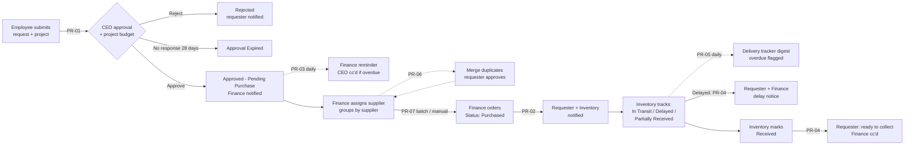

# OfficeAutomation – Purchase Requests: Approval, Ordering & Delivery Tracking

An end-to-end purchase request process built only on Microsoft 365 tools that
most organisations already license (SharePoint Online, Power Automate
standard connectors, Outlook, Teams). No premium connectors or Power Apps
licences are needed.

## What it does

1. **An employee submits a purchase request** through a SharePoint list form
   (web, Teams tab or the Microsoft Lists mobile app), **linked to a
   project**.
2. **The CEO gets an approval request** in Outlook (actionable email), Teams
   (Approvals app) and the Power Automate mobile app, and can approve or
   reject with comments. Optionally, it shows the project's budget,
   committed spend and remaining budget.
3. **Approved requests go to Finance** by email (and optionally a Teams
   channel post). Rejections go back to the requester with the CEO's comments.
4. **Finance prepares orders**:
   * assigns a **supplier** to each request and works from a view **grouped
     by supplier**, with item counts and cost totals;
   * **merges duplicate requests**, after the affected requesters approve
     the merge;
   * **orders everything from one supplier in one click**: a consolidated
     order sheet, an optional email to the supplier, and all items marked
     *Purchased* with one PO number.
5. **Finance places the order and marks it Purchased**, with the PO number,
   actual cost and expected delivery date. The requester and the
   **inventory manager** are notified.
6. **The inventory manager tracks the delivery**, updating the status (*In
   Transit*, *Delayed*, *Partially Received*), carrier, tracking number,
   revised date and a running *Delivery Updates* log. Requesters are told
   automatically about delays.
7. **When the goods arrive, the inventory manager marks the request
   Received** (quantity, condition, delivery-note photo). The requester is
   told it's ready to collect, and Finance is copied to match the invoice.
8. **Automatic reminders every weekday:**
   * **Finance**: approved requests not yet purchased; the CEO is copied
     when overdue.
   * **Inventory**: every open order with its due date, overdue orders
     highlighted, and orders with no ETA flagged. Finance is copied when an
     order is badly late. Overdue orders can be flagged as *Delayed*
     automatically.
   * **CEO**: approvals waiting too long.

## Components

| Component | Purpose | Guide |
|---|---|---|
| SharePoint list **Purchase Requests** | Stores requests, CEO decision, purchase and delivery details. Requesters can add and view their own items only. | [01 – SharePoint setup](docs/01-sharepoint-setup.md) |
| Flow **PR-01 Submit & CEO Approval** | Runs when a request is created, gets the CEO's decision, routes to Finance | [02](docs/02-flow-ceo-approval.md) |
| Flow **PR-02 Order Placed** | Runs when Finance sets *Purchased*, notifies the requester and the inventory manager | [03](docs/03-flow-order-placed.md) |
| Flow **PR-03 Pending Purchase Reminders** | Weekday digest of approved-but-not-ordered requests, escalation to the CEO, nudge for stale approvals | [04](docs/04-flow-pending-reminders.md) |
| Flow **PR-04 Delivery Updates** | Runs when Inventory sets *Received* or *Delayed*, stamps receipt details, notifies the requester (and Finance) | [05](docs/05-flow-delivery-updates.md) |
| Flow **PR-05 Delivery Tracking Digest** | Weekday tracker of open orders for the inventory manager, delays highlighted, optional auto-flag *Delayed* | [06](docs/06-flow-delivery-tracking.md) |
| Flow **PR-06 Merge Duplicate Requests** | Finance sets *Merge Into Request #*; the requester(s) approve; quantities combine and the duplicate is closed | [10](docs/10-flow-merge-duplicates.md) |
| Flow **PR-07 Order all from this supplier** | Run from the list's *Automate* menu: batch-orders every approved request for a supplier | [11](docs/11-flow-supplier-batch-order.md) |
| **Projects** & **Suppliers** lists | Lookup lists for linking requests to projects (with budgets) and to suppliers | [09](docs/09-projects.md), [11](docs/11-flow-supplier-batch-order.md) |
| User guide | Submitting, approving, ordering, tracking and receiving | [07 – User guide](docs/07-user-guide.md) |
| Testing & operations | Test plan, monitoring, troubleshooting | [08 – Testing & operations](docs/08-testing-and-operations.md) |
| `scripts/Deploy-PurchaseRequestList.ps1` | Creates the list, columns, views, permission level and groups in one go | [01](docs/01-sharepoint-setup.md) |

## Request lifecycle

| Status | Set by | Meaning |
|---|---|---|
| Submitted | Column default | Just created (lasts a few seconds) |
| Pending CEO Approval | PR-01 | Waiting for the CEO |
| Approved - Pending Purchase | PR-01 | CEO approved; Finance needs to order it. *Finance reminders run in this state.* |
| Purchased | Finance | Order placed; PR-02 notifies the requester and Inventory. *Delivery tracking starts.* |
| In Transit | Inventory | Shipped; carrier and tracking recorded |
| Delayed | Inventory, or PR-05 automatically when past due | Late; PR-04 notifies the requester and Finance (again whenever the revised date changes) |
| Partially Received | Inventory | Part of the order arrived; still tracked |
| Received | Inventory | Done; PR-04 notifies the requester and Finance |
| Rejected | PR-01 | CEO rejected |
| Approval Expired | PR-01 | CEO didn't respond within 28 days; the requester resubmits |
| Cancelled | Finance/CEO | Withdrawn; no more reminders |
| Merged | PR-06 | Duplicate merged into another request (after requester approval); its requester follows the other request |

Delivery lateness is measured against **Delivery Due**, which is the
*Revised Delivery Date* if set, otherwise the *Expected Delivery Date*. The
original expected date is kept, so you can report on how late vendors are.

## Quick start

1. **Prerequisites:** a SharePoint site (e.g. *Operations*), the CEO's email,
   Finance and Inventory distribution lists (or individual addresses), and
   ideally a service account (e.g. `automation@yourorg.com`) with a
   Microsoft 365 licence to own the flows. See
   [08 – Testing & operations](docs/08-testing-and-operations.md#ownership).
2. **Create the list:** run `scripts/Deploy-PurchaseRequestList.ps1`, or
   follow the manual steps in [docs/01](docs/01-sharepoint-setup.md).
3. **Build the flows** in [Power Automate](https://make.powerautomate.com):
   PR-01 to PR-05 following docs [02](docs/02-flow-ceo-approval.md) to
   [06](docs/06-flow-delivery-tracking.md), then PR-06 and PR-07 from
   [10](docs/10-flow-merge-duplicates.md) and
   [11](docs/11-flow-supplier-batch-order.md), and optionally the budget
   check from [09](docs/09-projects.md). Each guide lists every action,
   setting and expression to paste in.
4. **Add your projects and suppliers** to the *Projects* and *Suppliers*
   lists.
5. **Test** with the checklist in [docs/08](docs/08-testing-and-operations.md).
6. **Roll out:** share the list link, add Teams tabs (*Pending Purchase* for
   Finance, *Awaiting Delivery* for Inventory), and send staff the
   [user guide](docs/07-user-guide.md).

## Configuration values

Each flow sets these at the top in *Initialize variable* actions, so you can
change them in one place:

| Variable | Example | Used in |
|---|---|---|
| `CEOEmail` | `ceo@yourorg.com` | PR-01, PR-03 |
| `FinanceEmail` | `finance@yourorg.com` | PR-01, PR-03, PR-04, PR-05, PR-06, PR-07 |
| `InventoryEmail` | `stores@yourorg.com` | PR-02, PR-05 |
| `EscalateAfterDays` | `5` | PR-03: pending purchases older than this are flagged and the CEO is copied |
| `CEOReminderAfterDays` | `2` | PR-03: approvals waiting longer than this trigger a nudge to the CEO |
| `TimeZone` | `India Standard Time` | PR-05: works out "today" for due dates |
| `DueSoonDays` | `2` | PR-05: deliveries due within this many days are highlighted amber |
| `ChaseAfterDays` | `3` | PR-05: deliveries this many days late copy Finance to chase the vendor |
| `AutoFlagDelayed` | `true` | PR-05: automatically set overdue *Purchased* / *In Transit* orders to *Delayed* |
| `OrgName` | `Your Organisation Ltd` | PR-07: signature on supplier orders |

To manage these centrally, create the flows inside a Power Platform
**solution** and use environment variables instead.
